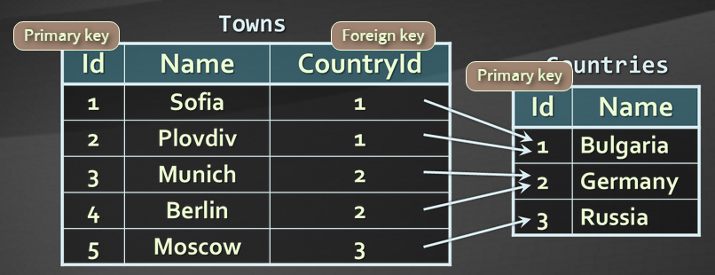
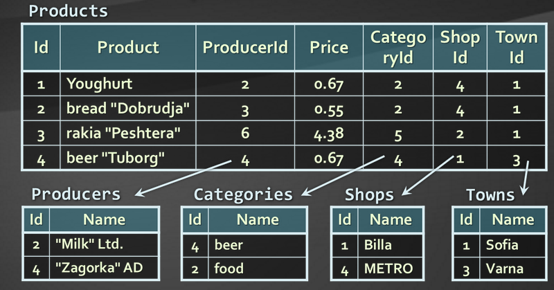

## Database Systems - Overview
### *Homework*

>  *What database models do you know?*
### Database models

#### Hierarchical (tree)
In a hierarchical model, data is organized into a tree-like structure, implying a single parent for each record. The root element doesn't have parent.

#### Network / graph
The network model expands upon the hierarchical structure, allowing many-to-many relationships in a tree-like structures like graphs that allows multiple parents.

#### Relational (table)
The basic data structure of the relational model is the table, where information about a particular entity (say, an employee) is represented in rows (also called tuples) and columns. Thus, the "relation" in "relational database" refers to the various tables in the database; a relation is a set of tuples.

* Represent a bunch of tables together with the relationships between them.
* Rely on a strong mathematical foundation: the relational algebra.
* Relation is a relation between a column in a table to a column in other table.

#### Object-oriented
In the 1990s, the object-oriented programming paradigm was applied to database technology, creating a new database model known as object databases. This aims to avoid the object-relational impedance mismatch - the overhead of converting information between its representation in the database (for example as rows in tables) and its representation in the application program (typically as objects).

>*Which are the main functions performed by a Relational Database Management System (RDBMS)?*
### Main functions performed by a Relational Database Management System (RDBMS)
Relational Database Management Systems (RDBMS) manage data stored in tables. The tables consists of rows and columns.

**RDBMS systems typically implement**

* Creating / altering / deleting tables and relationships between them (database schema)
* Adding, changing, deleting, searching and retrieving of data stored in the tables
* Support for the SQL language
* Transaction management (optional)

**RDBMS systems are also known as:**

* Database management servers
* Or just database servers

> *Define what is "table" in database terms.*
### "Table" in database terms

Database tables consist of data, arranged in rows and columns. For example (table Persons):

|Id	| First Name | Last Name | Employer

|1	|	Steve	|	Jobs	|	Apple

|2	|	Bill	|	Gates	|	Microsoft

|3	|	Jeff	|	Bezos	|	Amazon

* All rows have the same structure
* Columns have name and type (number, string, date, image, or other)
* **Table** have **schema**. The **schema of a table** is an ordered sequence of column specifications (name and type). In the example above the schema of the Persons table is:

		Persons (
		  Id: number,
		  FirstName: string,
		  LastName: string,
		  Employer: string
		)

> *Explain the difference between a primary and a foreign key.*
### Difference between a primary and a foreign key

**Primary key** is a column of the table that uniquely identifies its rows (usually its is a number). Two records (rows) are different if and only if their primary keys are different. The primary key can be composed by several columns (**composite primary key**).

**Foreign key** is a column (or collection of columns) in one table that uniquely identifies a row of another table. We can say that the foreign key is defined in a second table, but it refers to the primary key in the first table.

Example:

> *Explain the different kinds of relationships between tables in relational databases.*
### Kinds of relationships between tables in relational databases

By using **relationships** we avoid repeating data in the database. In the last example the name of the country is not repeated for each town (its number is used instead). Relationships have multiplicity:

* **One-to-many** – e.g. country / towns.
	* A single record in the first table has many corresponding records in the second table.
	* Used very often(see the example above).
* **Many-to-many** – e.g. student / course.
	* Records in the first table have many corresponding records in the second one and vice versa.
	* Implemented through additional table

In this example the StudentId column of StudentsCourses table is a foreign key to Students table primary key, which is Id column of Students table. In the same way CourseId column of StudentsCourses table is a foreign key to the primary key of Courses table. The primary key of Courses table is Id column.

* **One-to-one** – e.g. example human / student
	* A single record in a table corresponds to a single record in the other table
	* Used to model inheritance between tables.

In this example the Id columns of the tables are primary and foreign keys in the same time.

* **Self-Relationships**
	* The primary / foreign key relationships can point to one and the same table
	* Represents some hierarchy like trees and graphs.

> *When is a certain database schema normalized? What are the advantages of normalized databases?*
### Normalizing database schema
* Normalization of the relational schema enters primary key.
* Normalization of the relational schema removes repeating data.
* Non-normalized schemas can contain many data repetitions, doesn't have primary key e.g. Example for non-normalized schema:

Example for full-normalized schema of the above table:

> *What are database integrity constraints and when are they used?*
### Use of database integrity constraints

**Integrity constraints** ensure data integrity in the relational database tables. Enforce data rules which cannot be violated. This is main difference between relational and non-relational database. There are several kinds of Integrity constraints:

* **Primary key constrain**t
	* Ensures that the primary key of a table has unique value for each table row
* **Unique key constraint**
	* Ensures that all values in a certain column (or a group of columns) are unique
* **Foreign key constraint**
	* Ensures that the value in given column is a key from another table
*** Check constraint**
	* Ensures that values in a certain column meet some predefined condition. Examples:
	
			(hour >= 0) AND (hour < 24)
or

			name = UPPER(name)

> *Point out the pros and cons of using indexes in a database.*
### Pros and Cons of using indexes in a database
**Indexes** are usually implemented as B-trees. Indexes can be built-in the table (**clustered**) or stored externally (**non-clustered**).
**Clustered** indexes are those who exist together with the main data in the b-tree structure.
**Non-clustered** indexes exist in apart structure, from the main data b-tree structure and have additional relation to the main data.

* Pros
	* Indexes speed up(exponentially) searching of values in a certain column or group of columns	

* Cons
	* Adding and deleting records in indexed tables is slower.
	* Working with **non-clustered** indexes is a little bit slower, because of the need of updating the indexes structure.
	* Costs resources(for memory on HDD, for processing on periodically refreshing)
	* Indexes should be used for big tables only (e.g. 50 000 rows)

> *What's the main purpose of the SQL language?*
### SQL language main purpose

**SQL** (Structured Query Language) is the main tool to work with databases. It is **Standardized declarative language** for manipulation of relational databases. SQL-99 is currently in use in most databases.

[Wikipedia Link to SQL article](https://en.wikipedia.org/wiki/SQL)

**SQL** language supports:

* Creating, altering, deleting tables and other objects in the database
* Searching, retrieving, inserting, modifying and deleting table data (rows)

**SQL** language consists of:

* DDL – Data Definition Language - defining the meta-data information(name of the field, type etc.)
	* Commands: CREATE, ALTER, DROP
* DML – Data Manipulation Language - manipulating the data via queries
	* Commands: SELECT, INSERT, UPDATE, DELETE

Example of SQL SELECT query:

			SELECT Towns.Name, Countries.Name
			FROM Towns, Countries
			WHERE Towns.CountryId = Countries.Id

> *What are transactions used for? Give an example.*
### Use of transactions
**Transactions** are a sequence of database operations which are executed as a single unit. They care for the data consistency. Either all of the operations in them execute successfully or none of them is executed at all.

**Example:**
A bank transfer from one account into another (withdrawal + deposit). If either the withdrawal or the deposit succeed and the entire operation succeeds or if they both fail the entire operation should be canceled.

**Transaction life-cycle:**

* Transactions guarantee the consistency and the integrity of the database
	* All changes in a transaction are temporary
	* Changes become final when COMMIT is successfully executed
	* At any time all changes done in the transaction can be canceled by executing ROLLBACK
* All operations are executed as a single unit
	* Either all of them pass or none of them

> *What is a NoSQL database?*
### NoSQL database
**NoSQL** term comes from “No SQL” or “Not Only SQL” abbreviation.

**NoSQL** database is non-relational data base model. The data is stored in classical JavaScript Object Notation(JSON) format.

**NoSQL** (originally referring to "non SQL" or "non relational") database provides a mechanism for storage and retrieval of data that is modeled in means other than the tabular relations used in relational databases. Such databases have existed since the late 1960s, but did not obtain the "NoSQL" moniker until a surge of popularity in the early twenty-first century, triggered by the needs of Web 2.0 companies such as Facebook, Google and Amazon.com.

Motivations for this approach include: simplicity of design, simpler "horizontal" scaling to clusters of machines, which is a problem for relational databases, and finer control over availability. The data structures used by NoSQL databases (e.g. key-value, graph, or document) differ slightly from those used by default in relational databases, making some operations faster in NoSQL and others faster in relational databases. The particular suitability of a given NoSQL database depends on the problem it must solve. Sometimes the data structures used by noSQL databases are also viewed as "more flexible" than relational database tables.

NoSQL databases are increasingly used in big data and real-time web applications. NoSQL systems are also sometimes called "Not only SQL" to emphasize that they may support SQL-like query languages.

Many NoSQL stores compromise consistency (in the sense of the CAP theorem) in favor of availability, partition tolerance, and speed. Barriers to the greater adoption of NoSQL stores include the use of low-level query languages (instead of SQL, for instance the lack of ability to perform ad-hoc JOIN's across tables), lack of standardized interfaces, and huge previous investments in existing relational databases. Most NoSQL stores lack true ACID transactions, although a few recent systems, such as FairCom c-treeACE, Google Spanner (though technically a NewSQL database), FoundationDB, Symas LMDB and OrientDB have made them central to their designs. (See ACID and JOIN Support.) Instead they offer a concept of "eventual consistency" in which database changes are propagated to all nodes "eventually" (typically within milliseconds) so queries for data might not return updated data immediately.

Not all NoSQL systems live up to the promised "eventual consistency" and partition tolerance, but in experiments with network partitioning often exhibited lost writes and other forms of data loss.[11] Fortunately, some NoSQL systems provide concepts such as "Write Ahead Logging" to avoid data loss. Current relational databases also "do not allow referential integrity constraints to span databases" as well.

> *Explain the classical non-relational data models.*
### Classical non-relational data models

Basic classification based on data model, with examples:

* **Column(or Wide-column) model**: Accumulo, Cassandra, Druid, HBase, Vertica
	* Key-value model with schema
* **Document**: Clusterpoint, Apache CouchDB, Couchbase, DocumentDB, HyperDex, Lotus Notes, MarkLogic, MongoDB, OrientDB, Qizx
	* Works with set of documents, e.g. JSON strings
* **Key-value**: CouchDB, Oracle NoSQL Database, Dynamo, FoundationDB, HyperDex, MemcacheDB, Redis, Riak, FairCom c-treeACE, Aerospike, OrientDB, MUMPS
	* Works with set of key-value pairs
* **Graph(or Hierarchical key-value model**: Allegro, Neo4J, InfiniteGraph, OrientDB, Virtuoso, Stardog
	* Hierarchy of key-value pairs
* **Multi-model**: OrientDB, FoundationDB, ArangoDB, Alchemy Database, CortexDB

> *Give few examples of NoSQL databases and their pros and cons.*
### NoSQL database examples

In the above question are given examples for NoSQL databases. The Pors and Cons are:

* Pros
	* Still support CRUD operations
	* Create, Read, Update, Delete
	* Still support indexing and querying
	* Still supports concurrency and transactions
	* Highly optimized for append / retrieve
	* Great performance and scalability	

* Cons
	* No data consistency
	* No database relations
